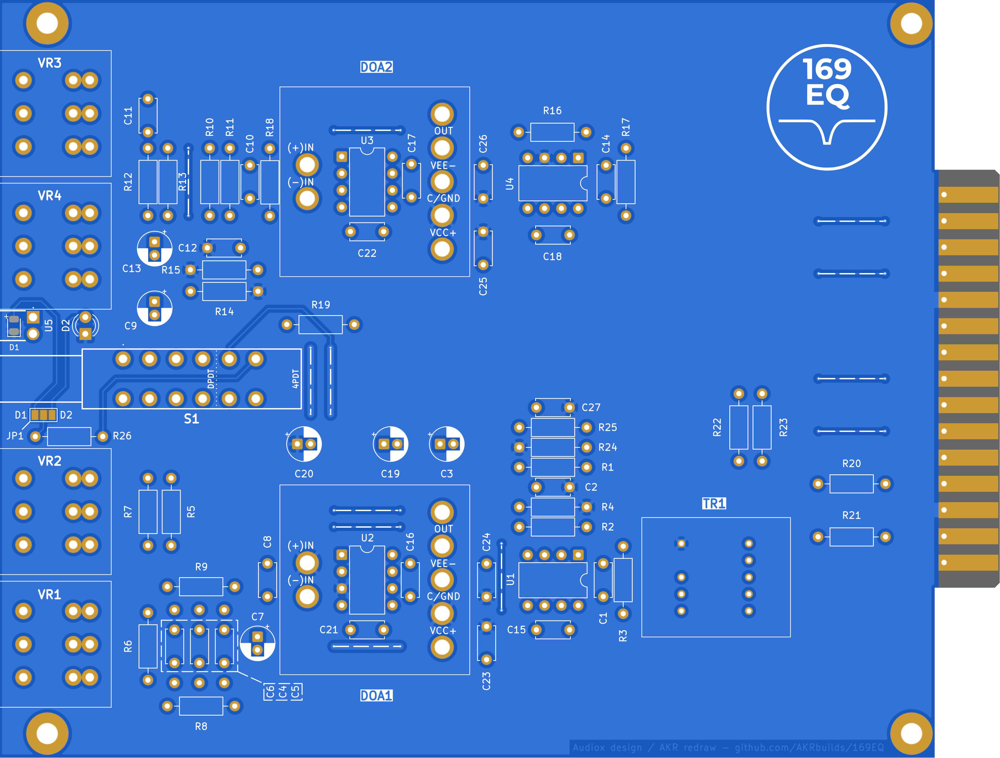
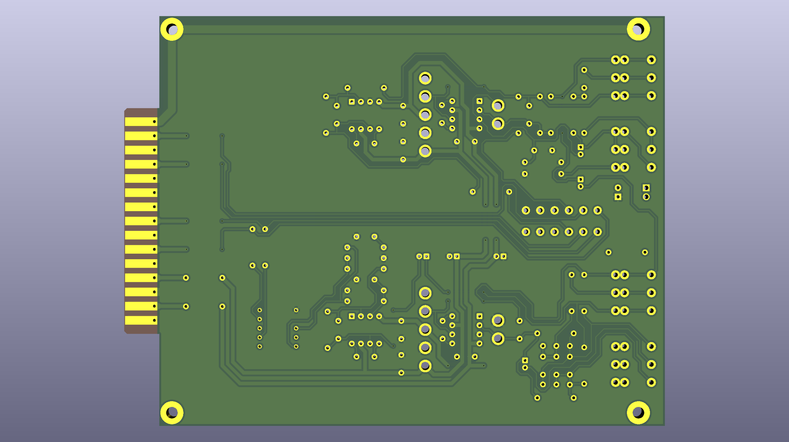

# 169EQ
Studer 169 EQ in API 500 format

Original project by AUDIOX on GroupDIY
* **Build thread on GroupDIY** [Studer 169 EQ in API 500 Format](https://groupdiy.com/threads/studer-169-eq-in-api-500-format.36522/)

## Support my work
If you found this PCB useful and want to support the development of future open-hardware projects, you can buy me a coffee!

## License
This hardware project (PCB) is licensed under the **CERN-OHL-S v2**.
You are free to copy, modify, and manufacture this design, provided that you distribute any derivative versions under the same license.

## Documentation
* 📄 [PCB Assembly overview (PDF)](assets/assembly.pdf)
* 📄 [Kicad Schematics (PDF)](assets/Schematics.pdf)
* 📄 [Original Schematics (PDF)](assets/original_schematics.pdf)
* 📄 [Front Panel (PDF)](assets/front_panel.pdf)
* [🌐 Open Interactive BOM](https://htmlpreview.github.io/?https://github.com/AKRbuilds/169EQ/blob/main/assets/ibom.html)

